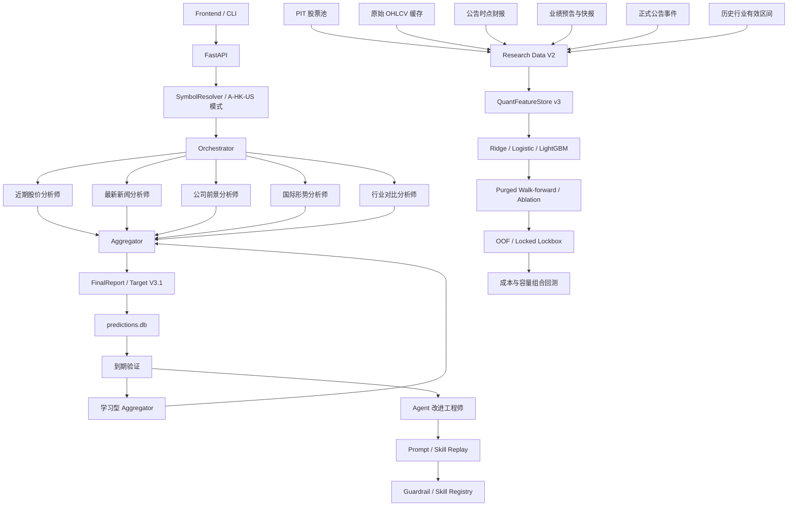

# Market Prediction 当前项目框架

更新日期：2026-07-14

适用分支：`codex-current-project-state-20260706`

说明：本文只描述当前工作树和正式 Research Data V2.2 产物中的有效实现。

## 1. 项目定位

Market Prediction 是面向 A 股、港股和美股的多 Agent 投研与预测验证平台，由两个权限隔离但数据互通的系统组成：

1. **预测系统**：五个专业 Agent 分析同一标的，Aggregator 输出 Target V3.1 决策并持久化。
2. **研究与改进系统**：用 PIT 数据、历史回放、统计模型、Prompt/Skill 沙箱、Walk-forward 和成本后组合回测验证改动。

项目不是自动交易系统。任何没有通过样本外概率、排序、收益、成本和锁箱门禁的候选都只能保留为 `shadow`。

## 2. 系统全景



## 3. 正式预测路径

1. `SymbolResolver` 根据输入和市场模式解析唯一证券。
2. `Orchestrator` 并发执行五个 Agent，并按实际完成数报告进度。
3. Agent 返回统一 `AnalysisResult`：方向、收益分布、证据、风险、状态和数据质量。
4. 新闻、基本面、行业和宏观证据按真实采集时间归档。
5. `Aggregator` 处理证据冲突、重复、缺失和质量折扣，输出 `FinalReport`。
6. `PredictionStore` 保存最终预测和每个 Agent 输出。
7. 到期验证器回填真实市场残差收益、Brier、误差和可操作边际评价。

单个 Agent 失败会成为结构化 `degraded/failed` 状态，不会直接令全链路崩溃。

## 4. Prediction Target V3.1

系统预测未来 N 个交易日相对市场基准、消除滚动 Beta 后的残差收益分布，以及是否存在可操作边际。

| 周期 | Horizon | 交易日 |
| --- | --- | ---: |
| 短期 | `5d` | 5 |
| 中期 | `20d` | 20 |
| 长期 | `60d` | 60 |

标签契约：

- 入场为预测时点可见收盘价，到期为之后第 N 个交易日收盘价；
- A/HK/US 基准分别为 `510300 / 2800 / SPY`；
- Beta 和波动率只能使用 `as_of` 之前数据；
- `residual return = stock return - beta * benchmark return`；
- 波动率缩放阈值产生唯一互斥的 `bullish / neutral / bearish`；
- 行业相对收益是特征，不改变正式市场残差标签；
- 未来价格只能进入标签，不能进入特征。

输出包括预期残差收益、P10/P50/P90、上涨/下跌/无边际概率、`edge_score`、决策和不交易原因。

## 5. 五个预测 Agent

| Agent | 核心证据 | 主要保护机制 |
| --- | --- | --- |
| 近期股价分析师 | K 线、分钟线、趋势、量价、波动率、支撑阻力 | 技术证据包、市场状态、Skill Registry、历史校准 |
| 最新新闻分析师 | 新闻、公告、事件和情绪 | 多源回退、相关性过滤、快照归档、质量上限 |
| 公司前景分析师 | 财务、估值、质量、增长和竞争力 | 基本面证据包、缺失拒绝强结论、PIT 归档 |
| 国际形势分析师 | 利率、汇率、流动性、政策和地缘 | 敏感度传导、实时/参考分级、PIT 归档 |
| 行业对比分析师 | 同业估值、ROE、景气和产业链 | 实时同行优先、缓存降权、覆盖审计 |

Prompt 位于 `src/prompts/`。动态 Guardrail 只能来自已通过验证的候选。当前数据工具主要是项目内 Python fetcher，不是运行时 MCP 服务。

## 6. Aggregator

生产 Aggregator 合并 Agent 概率、预期收益、置信度和质量，处理缺失、冲突、重复证据和不可交易状态。

正式路径仍使用静态权重和质量折扣。`LearnedAggregator` 已实现：

- 只读取严格 OOF 或已到期 live Agent 概率；
- 多折时间验证与 purge；
- 非负正则化权重；
- Agent 错误相关性和缺失模式；
- 配对 Brier 改善和 lockbox 门禁。

当前同一时点五 Agent 已验证概率仍不足，学习型权重保持关闭。

## 7. PIT 数据层

### 7.1 核心存储

- `data/predictions.db`：正式预测、Agent 输出和到期验证；
- `data/news_snapshots/`：正式新闻快照；
- `data/point_in_time_snapshots/`：基本面、行业和宏观快照；
- `data/quant/universe.db`：上市/退市有效区间；
- `data/quant/features.db`：版本化 Quant 特征和标签；
- `data/quant/pit_enrichment.db`：财务、业绩、公告和行业事件；
- `data/quant/price_cache/`：按证券保存的原始 OHLCV Parquet。

### 7.2 时点和血缘规则

`src/data/point_in_time_lineage.py`、`QuantFeatureStore` 和 enrichment store 共同保证：

- 当前采集不能伪造过去 `as_of`；
- 历史回放必须声明 `historical_replay` 和 `point_in_time_verified`；
- 源时间晚于 `as_of` 时不得连接；
- 当前/历史来源、派生方法、数据版本和实验 hash 可追溯；
- 当前缺失保持缺失，不用今天的数据回填历史。

## 8. Research Data V2.2

### 8.1 固定配置

当前配置：`config/quant/research_data_v2_2.json`

旧版 `research_data_v2.json` 和 `research_data_v2_1.json` 保留用于复现实验，不会被当前默认执行器覆盖。

执行器：`scripts/run_research_data_v2.py`

当前正式设置：

- A 股，2021-01-04 至 2025-12-01；
- 每 7 天一个截面，每个日期最多 200 只；
- 按交易所和板块分层，固定种子；
- 最少上市 180 天，价格不低于 1 元；
- 20 日平均成交额不低于 1,000 万元；
- 包含历史退市股票，避免生存者偏差；
- 统一 `quant_features.v3` 和 Target V3.1 市场残差标签。

流水线支持 `enrichment / dataset / walk-forward / portfolio` 分阶段执行，并可通过 `--experiment-id` 断点续跑。

### 8.2 丰富特征

`QuantPitEnrichmentStore` 保存：

- `FundamentalEvent`：报告期、公告/更新时间和财务字段；
- `PerformanceEvent`：业绩预告、业绩快报和正式发布时间；
- `AnnouncementEvent`：首次披露时间、标题和事件类别；
- `IndustryMembership`：行业标准和有效起止日期。

`features_as_of` 生成公告衰减强度、风险/催化强度、surprise 和当时有效行业。业绩快报可在正式财报披露前补齐已发布的 EPS、收入增速、利润增速和每股净资产；每条样本同时记录字段完整度、证据陈旧度、质量分、业绩事件可用性和 surprise 可计算性。数据集构建结束后，同一 `as_of` 计算估值分位、市场广度和行业相对排名；个股历史分位使用扩展窗口。

### 8.3 当前正式规模

- 31,946 条 `quant_features.v3`；
- 221 只有效股票；
- 257 个独立日期；
- 31,946 条市场 Beta 残差标签；
- 数据 hash `854de3f23967bc170422`。
- 公告时点基本面可用率 99.81%，高质量基本面 97.57%；
- 业绩预告/快报覆盖 94.26%，可计算 surprise 覆盖 21.12%。

旧 `quant_features.v2` 仍保留为独立分区。

## 9. 实验产物隔离

`src/core/experiment_manifest.py` 提供统一实验位置和清单：

- 正式产物：`output/<kind>/<experiment_id>/`；
- 测试产物：`.pytest-tmp/experiments/<kind>/<experiment_id>/`；
- 清单字段：来源类型、配置 hash、数据 hash、Git revision、分支、工作树状态、产物和指标；
- 数据删除、导出和训练显式限定 `feature_version`；
- Walk-forward 试验账本按市场、周期和特征版本隔离。

技术面 LLM 调优 API 的 pytest 候选和报告也使用测试目录，不再污染正式“最近运行”列表。

## 10. Quant 模型与验证

基线模型：

- 经验类别先验；
- 简单动量；
- Ridge 残差收益回归；
- Logistic 三分类；
- LightGBM Huber 残差收益回归。

特征集：

- `technical`；
- `technical_fundamental`；
- `technical_news`；
- `technical_industry`；
- `technical_valuation`；
- `research_v2`。

概率校准使用 `MulticlassProbabilityCalibrator`：基础模型只在 train 拟合，temperature 只在 validation 拟合，test 只应用参数并评分。Temperature scaling 保持各类别概率顺序，避免通过全部收缩为中性来虚假改善 Brier。报告同时保存 raw/calibrated Brier、ECE 和增量。

行业融合使用 `ConstrainedIndustryStacker`：技术基线和技术+行业模型分别训练，validation 只允许在 `[0, 0.35]` 内学习行业增量权重，test 使用冻结权重。V2.2 LightGBM 的折均行业权重约 5%，没有证据时自动退回纯技术基线。

固定验证使用 730 天训练、120 天验证、120 天测试、7 天 purge 和 180 天 lockbox。晋升除 Brier、IC、收益、校准和区间覆盖外，还要求至少 1% 的可操作覆盖，禁止永远预测中性的平凡模型晋级。

当前结论：技术 LightGBM 有正 Rank IC；temperature 将技术模型 ECE 从 0.1992 降至 0.1301；行业限权组合只得到约 5% 增量权重；全量 V2 负协同仍明显。所有候选仍为 `shadow_only`，lockbox 未解锁。

## 11. 组合评价层

`PortfolioBacktester` 支持：

- Top K、edge 门槛、波动率权重和最大单股仓位；
- A 股禁做空、卖出税和 T+1 提示；
- 佣金、滑点、价差、冲击和成交参与率；
- 容量硬裁剪、现金、换手、净值、回撤、Sharpe 和信息比率；
- 非重叠预测周期，避免未来收益重复复利；
- 正式实验 manifest。

V2.2 技术+行业在 10% 边际门槛下出现较强成本后超额，但概率 Brier、收益置信区间和可操作覆盖尚未同时通过，不能生产晋升。2% 低门槛仍表现为高换手、高成本和大回撤诊断场景。

## 12. Agent 改进工程

闭环：

```text
历史样本 / PIT 快照
→ 失败场景统计
→ LLM 生成候选 Prompt / Skill
→ baseline / candidate replay
→ 独立 holdout
→ 通过才写入 Guardrail 或 Skill Registry
```

自动权限只覆盖 Prompt Guardrail 和声明式 Skill。核心代码、MCP 和数据源增删只能生成建议，由用户决定是否实施。

Quant Core 与 Agent 改进工程共享“先样本外证明、再晋升”原则，但当前不会用未通过的 Quant 全量特征结果自动修改 Agent。

## 13. API 与前端

Quant 验证中心当前提供：

- 查看特征版本、PIT 事件和最近 Research Data V2.2；
- 刷新财报、业绩预告/快报、公告和历史行业区间；
- 构建分层 PIT 数据集；
- 运行三模型 Walk-forward、六组特征消融、validation-only 概率校准和行业限权 stacking；
- 训练学习型 Aggregator；
- 从 OOF 路径运行成本后组合回测；
- 触发到期验证和证据维护。

主要 API：

- `GET /api/quant/status`
- `POST /api/quant/refresh-enrichment`
- `POST /api/quant/build-dataset`
- `POST /api/quant/walk-forward`
- `POST /api/quant/train-aggregator`
- `POST /api/quant/portfolio-backtest`
- `GET /api/evidence-maintenance/status`
- `POST /api/evidence-maintenance/run`

## 14. 当前生产状态

- 五 Agent 正式预测：可用；
- Target V3.1 持久化与到期验证：可用；
- Prompt/Skill 候选沙箱：可用；
- Research Data V2.2：已完成正式构建和验证；
- Quant 模型：仅 shadow，无生产晋升；
- 学习型 Aggregator：未启用；
- lockbox：保持 locked；
- 自动交易：不存在。

当前框架的核心原则是：数据时点、标签一致性、版本隔离和样本外验证优先；功能完成不等于预测能力已经得到证明。
