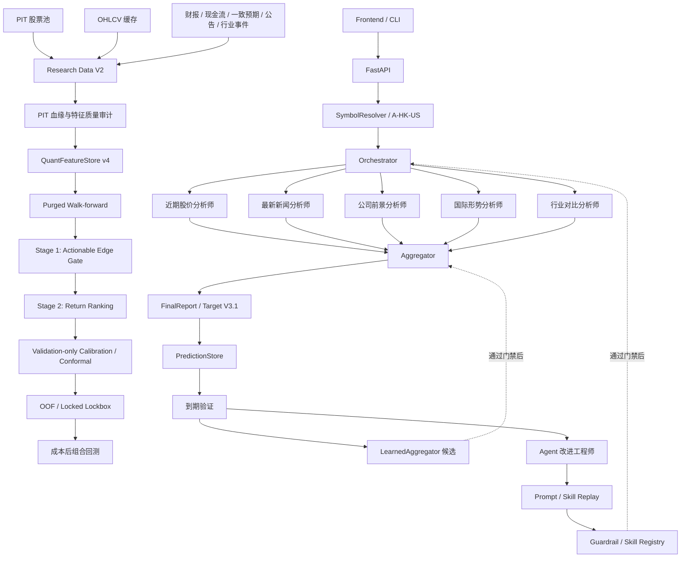

# Market Prediction V1 当前项目框架

更新日期：2026-07-16

适用分支：`v1`

本文只描述当前有效实现、实际运行数据和明确的生产边界。未来规划统一放在 `PROJECT_ROADMAP.md`。

## 1. 项目定位

Market Prediction V1 是一个面向 A 股、港股和美股的多 Agent 投研与预测验证平台，包含三个相互连接但权限不同的系统：

1. **实时预测系统**：五个专业 Agent 分析同一标的，Aggregator 输出收益分布、概率和可操作边际。
2. **Quant 研究系统**：使用 PIT 数据、统计模型、Walk-forward、lockbox 和成本后组合回测验证预测信息。
3. **Agent 改进系统**：从历史失败场景生成 Prompt/Skill 候选，通过 Replay 和 holdout 后才允许进入 Registry。

项目当前不是自动交易系统。Quant 模型、学习型 Aggregator 和新 Prompt/Skill 默认都是候选资产，没有通过门禁时只能保持 `shadow` 或草案。

## 2. 系统全景



## 3. 实时预测路径

1. 前端或 CLI 提交标的、市场模式和周期。
2. `SymbolResolver` 解析为唯一证券代码和市场。
3. `Orchestrator` 并发运行五个 Agent，并根据真实完成数报告进度。
4. 每个 Agent 返回统一 `AnalysisResult`，包括方向、预期收益、概率、证据、风险、状态和数据质量。
5. `Aggregator` 处理证据冲突、重复、缺失、质量折扣和不可交易条件。
6. `FinalReport` 输出 Target V3.1 收益分布、`edge_score`、决策与不交易原因。
7. `PredictionStore` 保存最终报告和各 Agent 结果；验证器在到期后回填真实结果。

单个 Agent 失败会转为结构化 `degraded/failed`，不会直接导致整个任务崩溃。异步任务状态保存在 `data/runtime_jobs.db`；服务重启后，中断任务会按重试预算重新排队，内存只保存当前进程的 `asyncio` task 句柄。

## 4. Prediction Target V3.1

系统目标是未来 N 个交易日、相对市场基准并消除滚动 Beta 后的残差收益分布。

| 用户周期 | Horizon | 交易日 | 默认基准 |
| --- | --- | ---: | --- |
| 短期 | `5d` | 5 | A: `510300` / HK: `2800` / US: `SPY` |
| 中期 | `20d` | 20 | 同市场基准 |
| 长期 | `60d` | 60 | 同市场基准 |

核心契约：

- `residual return = stock return - rolling beta * benchmark return`；
- Beta、波动率和所有特征只允许使用 `as_of` 之前数据；
- 波动率缩放阈值生成互斥的 `bullish / neutral / bearish`；
- 输出 expected return、P10/P50/P90、P(涨/跌/无边际)、`edge_score` 和决策；
- 未来价格只能进入标签和到期验证，不能进入预测特征。

代码和数据库 schema 已支持 V3.1。新预测会进入 cohort，并保存代码 revision、Prompt bundle hash、Skill Registry hash、LLM、Agent 状态和证据引用；到期验证支持持久计划与指数退避重试。首条真实样本 `bbe5fe8e` 已进入 `v3.1-forward-phase0-20260715`，计划在 2026-07-22 后验证。

## 5. 五个预测 Agent

| Agent | 主要证据 | 当前保护机制 | 当前验证边界 |
| --- | --- | --- | --- |
| 近期股价分析师 | K 线、量价、趋势、波动、支撑阻力 | 技术证据包、数据质量、市场状态、Skill Registry | 技术历史样本最多，但已启用 Skill 仍来自小规模验证 |
| 最新新闻分析师 | 新闻、正式公告、事件、情绪 | 多源回退、相关性过滤、快照归档、质量上限 | PIT 归档可用，尚无大规模 Agent OOF 能力证明 |
| 公司前景分析师 | 财务、估值、增长、质量、竞争力 | 基本面证据包、缺失拒绝强结论、PIT 归档 | Quant 特征覆盖高，不等于 LLM Agent 输出已验证 |
| 国际形势分析师 | 利率、汇率、流动性、政策、地缘 | 敏感度传导、实时/参考分级、PIT 归档 | 个股级边际贡献尚未得到历史证明 |
| 行业对比分析师 | 同业估值、ROE、景气、产业链 | 实时同行优先、缓存降权、历史行业区间 | 技术+行业存在弱增量，行业 Agent 本身仍缺 OOF |

Prompt 位于 `src/prompts/`；已验证的动态 Guardrail 由 `src/prompts/dynamic_overrides.py` 加载。数据工具主要是项目内 Python fetcher，当前不是运行时 MCP 服务。

五个 Agent 可配置使用同一个 LLM API，也可通过模型注册表切换兼容 Chat Completions 的模型。共享模型会造成错误相关，Aggregator 不应把五个结果视为独立投票。

## 6. Aggregator

生产 Aggregator 当前使用静态基础权重、数据质量折扣、失败重分配、冲突度和证据审计来生成最终结论。

`LearnedAggregator` 已实现：

- 只接收严格 OOF 或已到期 live Agent 预测；
- 按时间多折验证和 purge；
- 非负正则化权重；
- Agent 错误相关性与缺失模式；
- 相对静态基线的 Brier 门禁；
- lockbox 与显式激活开关。

当前学习型 Aggregator 未启用。原因不是缺代码，而是数据库只有 33 条旧预测和 1 条未到期 V3.1 预测，无法支持五 Agent 同时点、跨状态的可靠权重学习。

## 7. 数据与持久化

### 7.1 实时与历史资产

- `data/predictions.db`：正式预测、Agent 结果和到期验证；
- `data/news_snapshots/`：新闻快照；
- `data/point_in_time_snapshots/`：基本面、行业和宏观快照；
- `data/quant/universe.db`：股票上市/退市有效区间；
- `data/quant/features.db`：版本化 Quant 特征和标签；
- `data/quant/pit_enrichment.db`：财务、业绩、公告和行业事件；
- `data/quant/price_cache/`：原始 OHLCV 缓存。
- `data/quant/experiment_ledger.db`：跨实验只追加试验账本；
- `data/runtime_jobs.db`：可重启恢复的异步分析任务状态。

当前本地运行资产包括 65 个新闻快照文件、124 个其他 PIT 快照文件、34 条正式预测和 23 条已验证旧预测。这些本地数据不进入 Git。

### 7.2 PIT 与血缘规则

`point_in_time_lineage.py`、`QuantFeatureStore` 和 enrichment store 共同约束：

- 当前采集不能伪装成过去快照；
- 历史回放必须声明来源类型和 PIT 验证状态；
- `source_time > as_of` 的证据不能连接；
- 数据版本、采集时间、派生方法和实验 hash 可追溯；
- 缺失保持缺失，不使用今天的数据填充历史。

## 8. Research Data V2.4

当前正式配置：`config/quant/research_data_v2_4.json`

正式实验：`output/research_data_v2/phase2_v24_20260716/`

固定数据资产：

- A 股 `5d`，2021-01-04 至 2025-12-01；
- 31,948 条 `quant_features.v4`；
- 222 只股票、257 个日期；
- 固定分层股票池，包含历史退市标的；
- 价格、流动性、上市时间和 PIT 事件约束；
- Target V3.1 市场 Beta 残差标签覆盖 100%；
- 4,134 条最终 lockbox 样本保持 locked。

PIT enrichment 当前保存 25,992 条因子事件、覆盖 378 只股票，包括利润表、资产负债表、现金流量表和券商一致预期。每条记录均保存 `effective_date`、`report_date`、来源引用和采集血缘。V4 派生严格历史市值、账面市值比、现金转换、应计项、资本开支、预测修正/分歧、行业收益离散度、流动性拥挤和行业相对排名。

正式覆盖率：技术 100%、基本面 99.81%、现金流/资产负债/历史市值约 99.77%、行业 92.79%、一致预期 41.09%。特征审计报告位于 `audit/quant_feature_audit.json`；PIT 血缘违规为 0。漂移超限的原始 `fundamental__flash_revenue_yoy_pct` 保留在数据审计层，但被正式模型配置排除。

## 9. Quant 模型与验证

当前模型：

- 经验类别先验；
- 简单动量；
- Ridge 收益回归；
- Logistic 三分类；
- LightGBM Huber 收益回归。

两阶段候选：

- 第一阶段使用 Logistic 或 LightGBM，预测是否存在可操作边际；
- 第二阶段使用 Ridge、LightGBM Huber regression 或 LightGBM LambdaRank，只对候选学习收益与横截面排序；
- 特征在每个 `as_of` 截面内标准化；预测在测试前按行业、波动和流动性暴露中性化；
- gate 概率校准、gate 阈值和 conformal 区间半径只使用 validation；
- 经验先验按每个 fold 的 train 估计，再投射到该 fold test，禁止读取整个 development 标签；
- 完整模型、无风险控制两阶段模型和一阶段模型在相同 fold 做消融。

Phase 2 在固定 Logistic Gate + LightGBM regression 下比较七个特征组合：`technical`、`technical_size`、`technical_cashflow`、`technical_consensus`、`technical_events`、`technical_industry_v2` 和 `phase2_full`。每个新增特征族必须相对纯技术同时满足概率不退化、排序或 Top-K 收益有增量，完整特征包不享有默认优先级。

验证协议：

- 730 天 train、120 天 validation、120 天 test；
- train/validation/test 之间保留 7 天 purge；
- 7 折 Walk-forward；
- 一阶段基线的 temperature 与两阶段 Gate 的 sigmoid/isotonic 均只在 validation 拟合，test 只应用冻结参数；
- 180 天最终 lockbox 默认不读取；
- 同时评价 Brier、ECE、Rank IC、方向收益、区间覆盖和可操作覆盖。

Phase 1 正式实验 `phase1_two_stage_v1b_20260716` 完成 7 折、12 个候选和 13,564 条 OOF 测试预测。最佳候选 Brier `0.170377`，仅略优于折内经验先验 `0.171348`，未达到预注册改善；Rank IC `0.033743` 且置信区间为正，但 Top-K 收益区间跨 0。严格 PIT 历史市值尚未进入特征表，因此规模暴露晋升门禁保持关闭。所有模型继续为 `shadow_only`。

Phase 2 正式实验 `phase2_two_stage_v2b_20260716` 同样使用 7 折和 13,564 条 OOF 测试预测。最佳 `technical_industry_v2` 的 Brier 为 `0.169450`，相对经验先验改善 `0.001896`，略低于预注册 `0.002`；Rank IC 为 `0.020791`，95% 下界 `0.013419`。它相对纯技术通过特征增量门禁，但 Top-K 平均收益仍为负。规模暴露覆盖已达到 `99.7684%`，七个组合仍全部 `shadow_only`。

### 当前研究治理

全局 SQLite 账本按研究问题分别累计试验。Phase 1 和 Phase 2 使用独立研究族记录完整正式试验；账本只允许追加，记录数据/配置 hash、候选、阈值、指标和失败结论。Phase 2 两阶段组合策略固定为预注册 `a-5d-two-stage-phase2-edge-005-v1`；阈值不能根据 test 或组合结果回选。

## 10. 组合评价层

`PortfolioBacktester` 支持：

- Top K、edge 阈值、波动率权重和最大仓位；
- A 股禁做空、交易税费、滑点、价差和冲击；
- 成交参与率与容量裁剪；
- 非重叠持有期；
- 净值、换手、成本、回撤、Sharpe 和信息比率；
- moving block bootstrap、独立日期/持仓日/选股次数、利润集中度；
- 牛熊震荡、波动率和流动性状态稳定性门禁。

当前 V2.3 development OOF 上，10% edge 阈值仍出现正点估计，但 block bootstrap 下界为负，实际持仓日和选股次数不足，利润高度集中且多个状态存在严重亏损。所有组合保持 `shadow_only`，最终 lockbox 继续锁定。

Phase 1 会把每个两阶段 OOF 候选自动送入同一组合评价器。12 个候选均未通过完整门禁；其中个别模型有正净收益点估计，但正收益 bootstrap、利润集中或最差市场状态仍失败。因此两阶段模型没有改变生产状态。

Phase 2 将七个特征族自动送入预注册 5% edge、A 股只做多组合评价。最佳模型的高 edge 预测主要为负向，而 A 股研究策略禁止做空，正向可交易选择极少；所有候选均未达到持仓日、交易数、bootstrap 和状态稳定性要求。该结果不会被用来事后降低阈值。

## 11. Agent 改进工程

闭环如下：

```text
PIT / 已到期历史样本
-> 失败场景聚类
-> LLM 生成候选 Prompt / Skill
-> baseline / candidate replay
-> 独立 holdout
-> 通过后进入 Guardrail / Skill Registry
-> canary、监控和回滚
```

当前权限：

- Prompt Guardrail 和声明式 Skill 可以在门禁通过后自动应用；
- 核心代码、MCP、数据源和校准器只能生成建议；
- 用户保留高风险修改审批权。

当前 Registry 有 13 条启用 Skill，全部属于近期股价分析师。三轮 LLM Prompt Replay 各使用 12 条样本，均未改变预测，因此候选没有晋升。现状证明候选管理链路存在，但不能证明系统已经具备广泛自我进化能力。

## 12. API 与前端

主要用户面：

- 实时五 Agent 分析与真实进度；
- Target V3.1 决策卡、K 线和分钟线；
- 历史预测、真实走势刷新与到期验证；
- LLM 模型注册与切换；
- 完整 LLM 调优闭环和候选结果；
- Skill Registry；
- Quant 验证中心。

主要 Quant API：

- `GET /api/quant/status`
- `POST /api/quant/refresh-enrichment`
- `POST /api/quant/build-dataset`
- `POST /api/quant/feature-audit`
- `POST /api/quant/walk-forward`
- `POST /api/quant/two-stage`
- `POST /api/quant/train-aggregator`
- `POST /api/quant/portfolio-backtest`
- `GET /api/evidence-maintenance/status`
- `POST /api/evidence-maintenance/run`

## 13. 当前生产边界

| 能力 | 当前状态 |
| --- | --- |
| 五 Agent 实时分析 | 可用，允许 degraded/failed |
| Target V3.1 代码与 schema | 可用 |
| 真实 V3.1 到期样本 | 尚未形成 |
| Prompt/Skill 候选沙箱 | 可用 |
| 技术面 Skill Registry | 13 条启用，证据规模有限 |
| A 股 `5d` Research Data V2.4 | 已构建并完成 Phase 2 特征审计与 development 验证 |
| 两阶段 Quant | Phase 2 行业族通过 OOF 增量门禁；整体概率/Top-K/组合门禁未通过 |
| Quant 生产模型 | 无，全部 shadow |
| 学习型 Aggregator | 未启用 |
| 最终 lockbox | locked |
| HK/US 与 `20d/60d` Quant | 未完成 |
| 纸面交易 | 未形成持续运行闭环 |
| 自动真实交易 | 不存在 |

当前框架最重要的规则是：实现完成不等于预测有效，development 回测优秀不等于可交易，只有预注册样本外证据和一次性 lockbox 才能改变生产状态。
